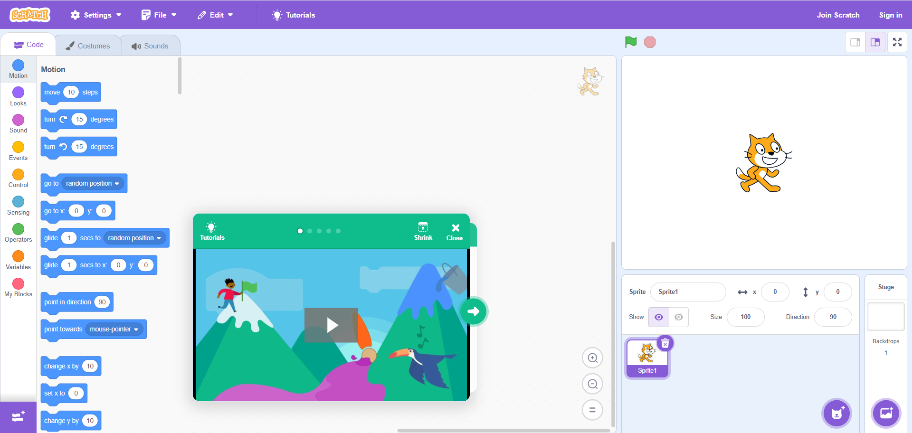

# 初学者AI课程大纲：用Scratch控制6轴机器人臂

## 课程目标
本课程为初学者介绍人工智能（AI）的基础知识，重点是通过Scratch控制6轴机器人臂。课程设计结合了AI理论概念与实际编程操作，提供双语（英语和中文）教学。

[Learn more about Scratch](https://scratch.mit.edu/)

## 课程时长
8周（每周2节课，每节课2小时）

## 第一周：AI与Scratch基础介绍
### 第一节课：
AI是什么？ - 基本概念和应用（英文与中文）
Scratch简介：界面和基础模块
练习：在Scratch中创建简单的动作序列。

### 第二节课：
了解6轴机器人臂：组件、动作和安全性。
Scratch与机器人臂的连接（硬件设置概览）。
练习：在Scratch中控制虚拟机器人臂以理解基本指令。

## 第二周：用Scratch编程动作
### 第一节课：
编程基本动作：移动、旋转和停止。
了解三维空间中的坐标和角度。
练习：编程机器人臂执行简单的取放任务。
### 第二节课：
复杂动作：展示多轴姿势。
在Scratch中引入循环和条件以实现精确控制。
练习：创建机器人臂姿势序列。

## 第三周：运动中的AI概念
### 第一节课：
机器人中的AI：感知和决策。
如何用Scratch模拟AI行为（如路径查找）。
练习：实现一个简单的AI行为，让机器臂对不同输入做出反应。
### 第二节课：
用Scratch探索AI算法如决策树。
教机器臂区分物体（基本图像识别）。
练习：根据检测到的形状编程机器臂选择不同的姿势。

## 第四周：增强互动
### 第一节课：
用户互动：用Scratch的输入模块控制机器臂。
人机交互（HRI）基础。
练习：创建一个用户控制机器臂姿势的互动环节。
### 第二节课：
反馈循环：让机器臂根据用户反馈调整。
练习：实现一个反馈机制，使机器臂调整其姿势。

## 第五周：实际应用和趣味项目
### 第一节课：
项目1：迷你艺术画廊 - 让机器臂展示不同的艺术作品。
练习：编程机器臂模仿绘画姿势或展示不同的艺术品。
### 第二节课：
项目2：舞蹈动作 - 教机器臂“跳舞”。
练习：创建一个包含不同速度和动作的舞蹈序列。

## 第六周：AI优化和挑战
### 第一节课：
优化动作以提升效率和精确度。
理解AI在优化机器人任务中的作用。
练习：完善之前创建的姿势以实现平滑和精确。
### 第二节课：
挑战：障碍避让和路径规划。
练习：编程机器臂在保持姿势的同时绕过障碍。

## 第七周：Scratch中高级AI技术
### 第一节课：
使用Scratch进行复杂的AI算法：模式识别。
练习：开发一个项目，使机器臂识别并分类对象。
### 第二节课：
协作项目：成对或小组工作，设计更复杂的AI驱动任务。
练习：团队项目，创建一个使用机器臂的互动展览。

## 第八周：复习和展示
### 第一节课：
回顾学到的AI概念及其在Scratch中的应用。
准备最终项目展示。
练习：对个人或团队项目进行最后的调整。
### 第二节课：
项目展示：学生展示他们的AI控制机器人臂项目。
反馈会和讨论未来AI学习路径。
练习：现场演示和问答环节。

## 课程材料：
Scratch软件（免费下载）
6轴机器人臂套件（如果没有物理硬件，可用模拟软件）
英文和中文课程幻灯片和视频
帮助和讨论的在线论坛

## 评估：
每周的练习形成作品集。
最终项目展示。

## 额外资源：
关于AI和机器人的进一步阅读链接（双语）。
更多与AI和机器人相关的复杂Scratch项目教程。