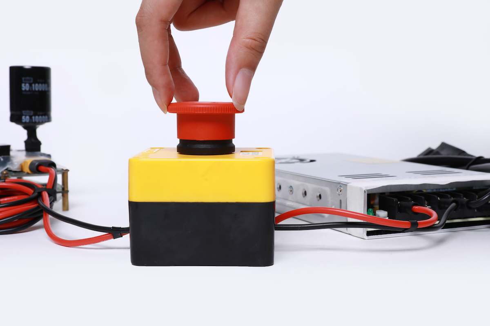

# 硬件连接及环境搭建

本文档以GLUON桌面型六轴机械臂为例，展示如何连接机械臂，以及在PC端运行ROS的过程。

## 硬件要求
PC电脑环境要求
- Ubuntu 18.04 操作系统
- CPU: 双核2GHz或更高
- 内存: 2GB或更高
- 硬盘：2GB或更高

## 第一步：连接电源
:::danger 注意

连接电源前请保证电源处于关闭状态。

:::

连接电源与ECB

## 第二步：连接执行器及其配件
连接执行器综合线缆

## 第三步：连接机械臂
用执行器连接线连接ECB与执行器

## 第四步：连接电脑
用网线连接ECB与电脑

## 第五步：连接后整体视图

## 第六步：开启电源

上电以后，执行器LED状态灯会变成黄色闪烁，启动执行器后，LED会变成绿色闪烁，这时就可以与执行器进行通信了。如果执行器内部出现错误，LED灯会变为红色闪烁，请检查执行器错误代码。