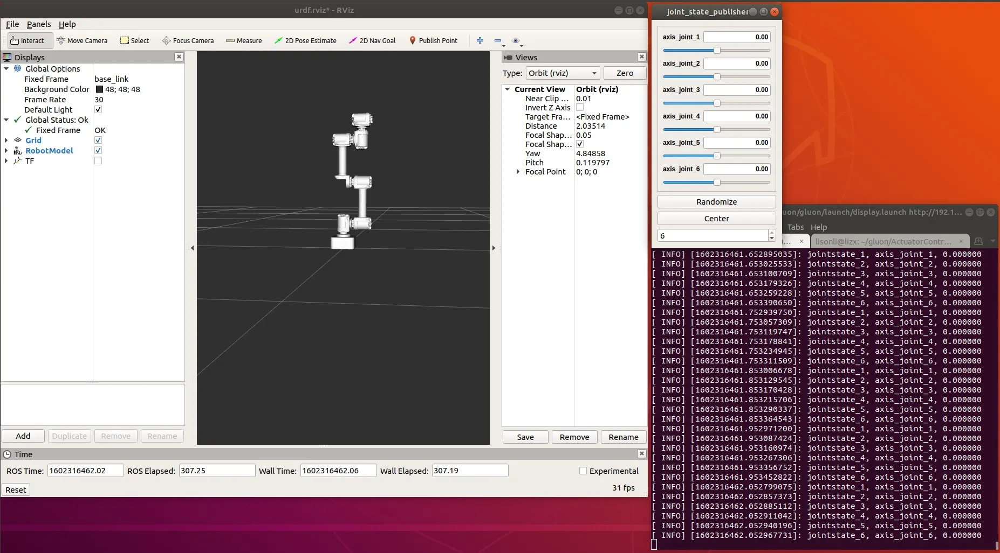

# 仿真与控制

ECB 默认IP 地址是192.168.1.30, PC 的IP 地址需要配置为同网段的192.168.1.1xx；运行demo前，需要确保机械臂在正确的零位位置。  

## Rviz 控制模式
```bash
roslaunch gluon display.launch
```


正确运行后，在rviz界面中可以看到gluon 机械臂urdf模型，拖拉joint_state_publisher窗口的滑动条即可控制机械臂运动，界面中的模型和真实机械臂联动 。

## Moveit + Rviz控制模式
```bash
roslaunch gluon_moveit_config cm_demo.launch
```
这个demo 在rviz展示gluon 模型，在界面中拖拽至目标点或设置Goal State（预设值），点击按钮Plan -> Execute或 Plan and Execute, 我们可以看到gluon 模型运动到目标位置的运动轨迹（真机同步联动）。

## Moveit教程实例
```bash
roslaunch moveit_tutorials move_group_interface_tutorial.launch
```
需要在cm_demo的基础上运行，提供了joint_state space 和 Cartesian 笛卡尔空间路径规划例子。
